# 검사 소프트웨어 매뉴얼

## 1. 소프트 개요

### 1.1. 소프트 개요

현재 검사 중인 결과와 과거 검사 결과를 열람할 수 있습니다.

| 화면명칭               | 화면내용                                                                                 |
| ---------------------- | ---------------------------------------------------------------------------------------- |
| **TOP 버튼 윈도우**    | 검사모드, History 모드, 저장경로, 시작, 종료, 시뮬레이션, 프로그램 종료 버튼 표시        |
| **검사모드**           | 검사 화면 표시                                                                           |
| **검사정보윈도우**     | 현재 진행 중인 검사 정보 표시 (Recipe 명, 다음 LOT 레시피, 진행 중 LOT ID, 작업 수량 등) |
| **크롭 이미지 윈도우** | 결함 이미지 표시                                                                         |
| **이미지 윈도우**      | Top, Bottom 이미지 및 검출 정보 표시                                                     |
| **Trend 그래프**       | 탭별 검출된 최대 검출 사이즈 표시                                                        |
| **결과 윈도우**        | 검출된 결함 정보를 표로 표시                                                             |
| **History 모드**       | 지난 검사 결과 조회 창 표시                                                              |
| **검색**               | LOT ID, LOT START TIME 기준 검색 및 Excel 내보내기 기능                                  |
| **저장경로**           | 파일 저장 경로 표시 및 바로가기 버튼 제공                                                |

---

## 2. 어플리케이션 기동 / 종료

### 2.1. 소프트 개요

프로그램의 바로가기가 바탕화면에 있습니다.  
해당 아이콘을 통해 프로그램을 기동할 수 있습니다.

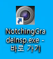

---

## 3. 검사진행 및 조작방법

### 3.1. 검사 진행시 조작 방법

#### 검사기 시작 화면

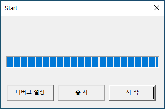

| 명칭            | 상세설명                                               |
| --------------- | ------------------------------------------------------ |
| **디버그 설정** | ALL, MELSEC, DIO, LIGHT, IMAGE 기능의 디버그 기동 가능 |
| **중지**        | 프로그램을 기동하지 않고 종료                          |
| **시작**        | 검사 화면으로 이동                                     |

#### 검사화면

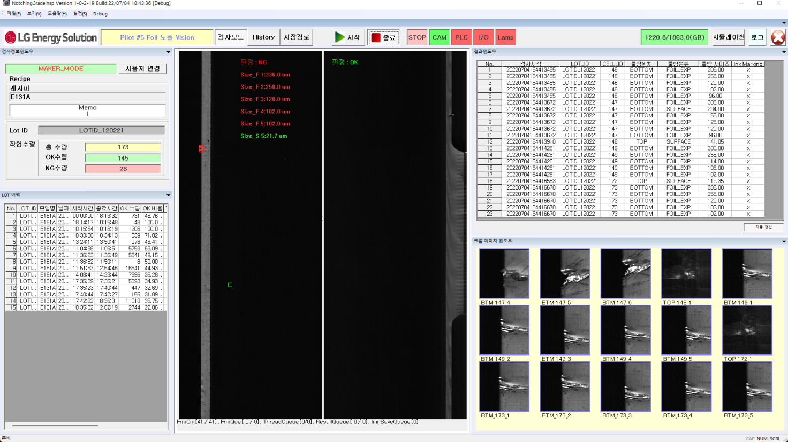

- **시작 버튼**을 눌러두면 제품이 진행될 때 자동으로 검사가 시작됩니다.

---

## 4. 화면구성

### 4.1. 소프트 화면 구성

검사기 시작 화면 종료 후 메인화면이 표시되며, 검사 실행이 가능합니다.  
유저 모드는 아래 2가지가 존재합니다.

| 모드                | 조작 가능 항목                                          |
| ------------------- | ------------------------------------------------------- |
| **오퍼레이터 모드** | Recipe 선택, 검사 시작, History 모드                    |
| **메이커 모드**     | Recipe 설정, 시스템 설정, 백업 및 삭제 설정, 시뮬레이션 |

> ※ 프로그램 기동 시 기본적으로 오퍼레이터 모드로 시작됩니다.  
> ※ 메이커 모드 이동 시 비밀번호 입력이 필요합니다.

---

### <검사모드>

검사 진행 시의 화면 구성입니다.

### <History 모드>

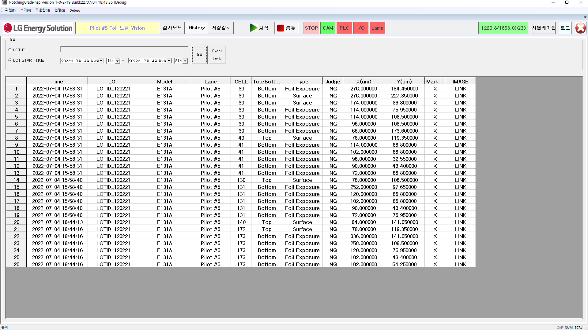

결과 조회 시의 화면 구성입니다.

### <저장경로>

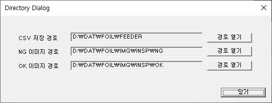

저장 경로 설정 화면 구성입니다.

### <시뮬레이션>

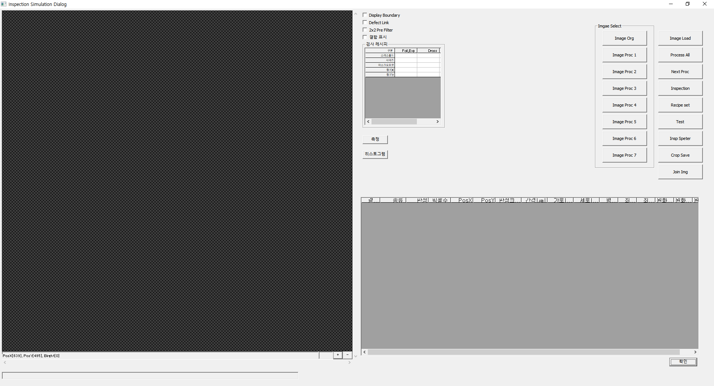

이미지를 이용한 시뮬레이션 확인 화면 구성입니다.

---

### 4.2. Top 버튼 윈도우

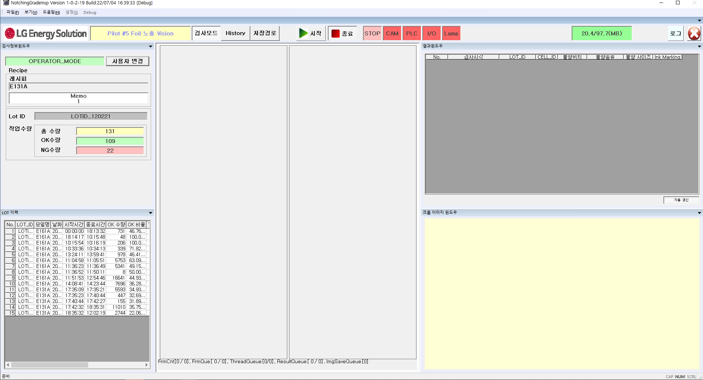

| 명칭          | 설명                                  |
| ------------- | ------------------------------------- |
| 검사모드      | 메인 화면을 검사 모드로 표시          |
| History       | 이전 검사 결과를 조회                 |
| 저장경로      | CSV, NG, OK 이미지 경로 설정          |
| 시작          | 검사 대기 상태 진입 후 자동 검사 시작 |
| 종료          | 검사 종료 상태로 변경                 |
| 상태 표시     | 현재 상태 표시                        |
| HDD 용량      | 디스크 용량 상태 표시                 |
| 시뮬레이션    | 이미지로 시뮬레이션 창 표시           |
| 프로그램 종료 | 프로그램 종료                         |

---

### 4.3. 검사 화면

#### 검사 정보 윈도우

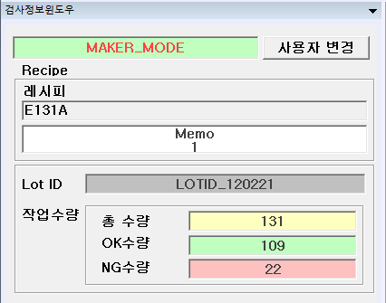

현재 검사 관련 정보 표시 (LOT, 수량, 레시피 등)

#### 사용자 변경

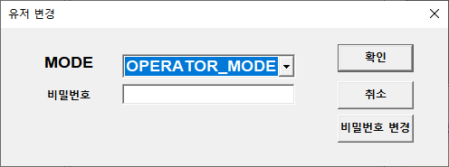

- **MODE:** OPERATOR_MODE, MAKER_MODE 존재
- **비밀번호:** 각 모드별 비밀번호 입력 필요
- **확인:** 비밀번호 일치 시 사용자 변경
- **비밀번호 변경:** 현재 모드의 비밀번호를 변경 가능

---

#### 크롭 이미지 윈도우

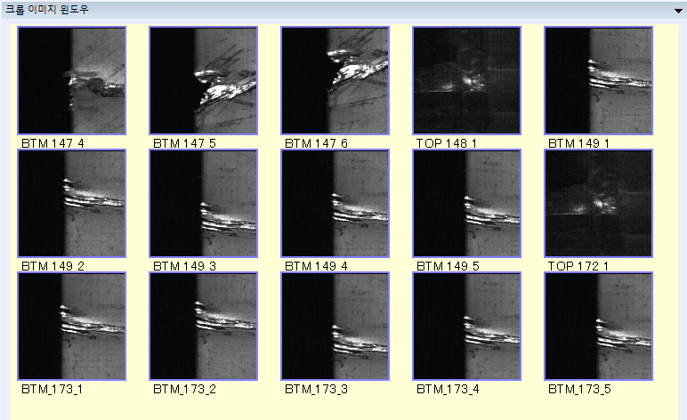

결함 크롭 이미지 표시

#### 이미지 윈도우

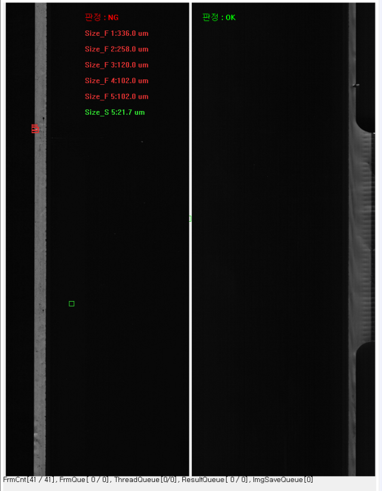

취득한 Image 및 결함 정보 표시

#### LOT 이력 창

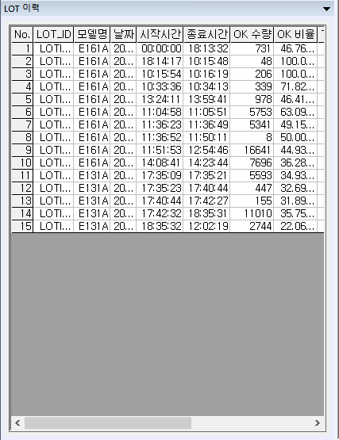

진행한 LOT 이력 확인 가능

#### 결과 윈도우

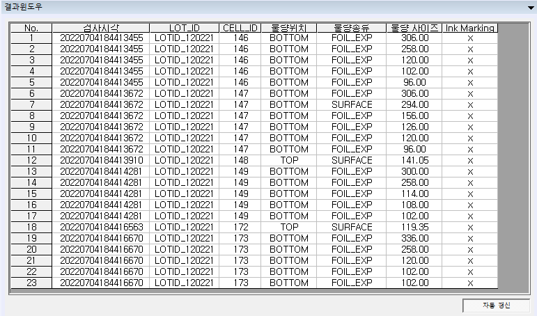

| 항목        | 설명                   |
| ----------- | ---------------------- |
| No          | 순서 번호              |
| 검사시각    | 검사 시간              |
| LOT_ID      | LOT ID                 |
| CELL_ID     | CELL ID                |
| 불량위치    | 불량 위치 (TOP/BOTTOM) |
| 불량종류    | SURFACE, FOIL_EXP 등   |
| 불량 사이즈 | 결함 크기              |
| Ink Marking | Ink Marking 여부       |

---

### 4.4. History 모드

#### 검색

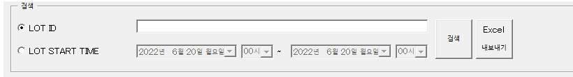

- **조건:** LOT ID / LOT START TIME 중 선택
- **Excel 내보내기:** 검색 데이터 엑셀 저장

#### 시간으로 조회

- LOT START TIME 기준으로 다수 LOT 표시

#### LOT ID로 조회

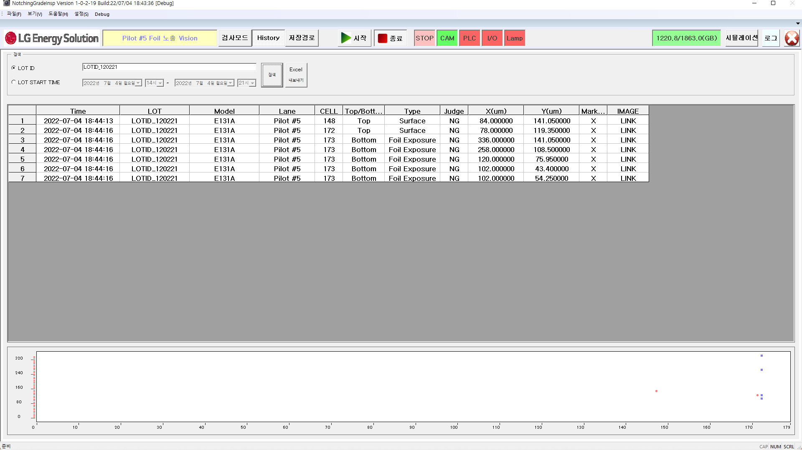

- 동일 LOT ID의 결함 표시
- ROLL MAP 표시
- Excel 내보내기 가능

---

## 5. 레시피 설정

### [메뉴] → [설정] → [레시피 설정]

| 번호 | 설명                             |
| ---- | -------------------------------- |
| ①    | 레시피 신규작성, 제거, 명칭 변경 |
| ②    | 레시피 선택                      |
| ③    | 설정값 표시/입력                 |
| ④    | 설정 보존 또는 취소              |

---

### 5.1. 레시피 조작

- 최대 50건 등록 가능

#### 레시피 선택

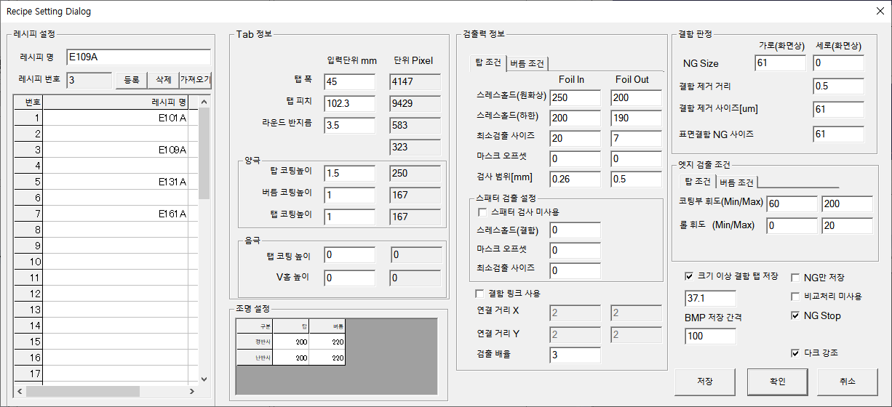
편집할 레시피 선택 시 해당 설정 내용 표시

#### 레시피 등록 절차

1. 복사할 원본 레시피 선택
2. 등록할 번호 선택
3. 레시피명 변경
   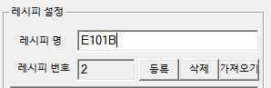
4. 등록 버튼 클릭
   
5. 저장 버튼 클릭 시 등록 완료

#### 레시피 저장

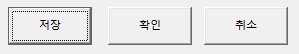

- 파라미터 변경 후 “저장” 클릭 시 저장
- “취소” 또는 “×”로 종료 시 저장되지 않음

#### 레시피 삭제

1. 삭제할 레시피 선택
   
2. “삭제” 버튼 클릭
   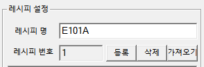

---

### 5.2. 파라메타 편집

트리 항목 클릭 시 각 설정 화면 표시

#### 주요 설정 항목

##### Tab 정보

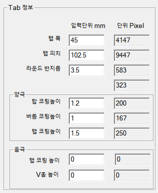

- 탭 폭
- 탭 피치
- 라운드 반지름

##### 양극

- 탑 코팅 높이
- 버틈 코팅 높이
- 탭 코팅 높이

##### 음극

- 탭 코팅 높이
- V홈 높이

##### 검출력 정보

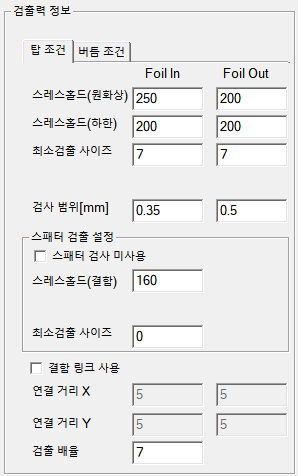

- 스레스홀드(원화상/하한)
- 최소검출 사이즈
- 검사 범위[mm]

##### 스페터 검출 설정

- 스페터 검사 미사용 여부
- 스레스홀드(결함)
- 최소검출 사이즈
- 결함 링크 기능 및 거리(X, Y)
- 검출 배율

##### 결함 판정

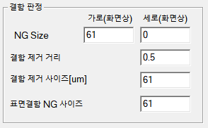

- NG Size(가로, 세로)
- 결함 제거 거리
- 표면결함 NG 사이즈

##### 엣지 검출 조건

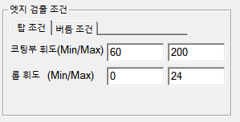

- 코팅부 휘도(Min/Max)
- 롤 휘도(Min/Max)

##### 이미지 저장 설정

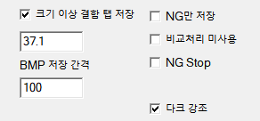

- 크기 이상 결함 탭 저장
- BMP 저장 간격
- NG만 저장 여부
- 비교처리 미사용
- NG Stop
- 다크 강조

---

### 주요 파라메터 설명

- **탭폭:** 탭의 폭
- **탭 피치:** 탭 간격
- **라운드 반지름:** 탭 어깨 라운드 반지름
- **코팅 높이:** 세라믹 높이 설정
- **스레스홀드:** 검출 기준 상/하한값
- **검사 범위:** 엣지 기준 In/Out 검사 범위
- **결함 링크:** 일정 거리 내 결함을 하나로 링크
- **NG Size:** NG 판정 기준 크기
- **엣지 검출 휘도:** 세라믹 코팅부/롤의 휘도 기준
- **이미지 저장 옵션:** NG만 저장, 간격 저장 등
- **NG Stop:** NG 발생 시 PLC로 신호 출력

---

## 6. 시스템 설정

> ⚠️ 이하 설정값은 임의 변경하지 마세요.

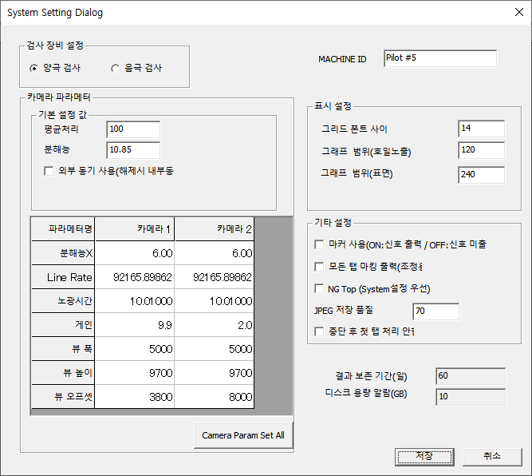

| 항목                    | 설명                                               |
| ----------------------- | -------------------------------------------------- |
| 검사 장비 설정          | 양극 / 음극 타입 설정                              |
| 카메라 파라메터         | 카메라 관련 파라메터 설정                          |
| 평균처리 / 분해능       | 카메라 성능 관련 설정                              |
| 외부 동기 사용          | 트리거 검사 시 외부 동기 사용, 미사용 시 내부 동기 |
| MACHINE ID              | 장비명 설정                                        |
| 표시 설정               | Grid 폰트 크기 설정                                |
| 마커 사용               | NG 발생 시 마커 출력 여부                          |
| 모든 탭 마킹 출력       | 마커 연속 출력 (조정용)                            |
| NG STOP (System 우선)   | NG 발생 시 STOP 신호 출력 설정                     |
| JPEG 저장 품질          | 이미지 저장 품질 설정                              |
| 중단 후 첫 탭 처리 안함 | 검사 중단 후 첫 탭 검사 여부                       |
| 결과 보존 기간(일)      | 결과 데이터 보존 기간 설정                         |
| 디스크 용량 알람        | 저장경로 디스크 용량 부족 시 알람 발생             |
